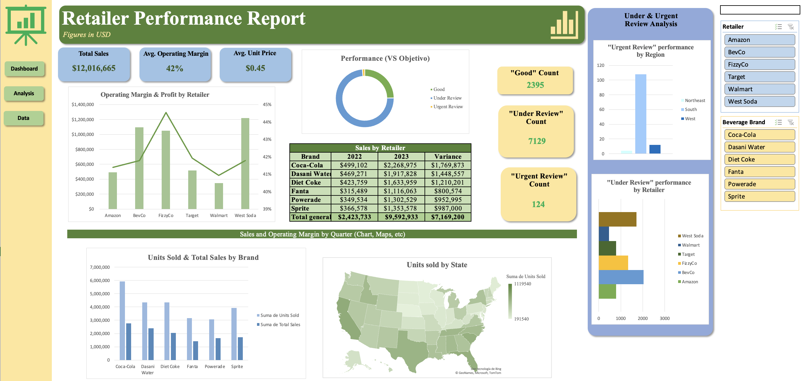

# 📊 Retailer Performance Dashboard (Excel)

An interactive business intelligence dashboard built in Microsoft Excel to analyze retailer and beverage brand performance across sales, margins, and geographic distribution.

This project demonstrates strong skills in data analysis, business insight generation, and dashboard design using Excel.

---

## 📌 Project Overview

The objective of this project is to evaluate retailer performance and identify business opportunities using structured sales and operational data.

The dashboard provides executive-level visibility into:

- Total Sales Performance
- Operating Margin Analysis
- Average Unit Price Trends
- Year-over-Year Growth (2022 vs 2023)
- Product Performance Classification (Good / Under Review / Urgent Review)
- Brand-Level Performance
- Retailer-Level Profitability
- Geographic Sales Distribution (U.S. state-level view)

This solution simulates a real-world commercial performance review used by sales, finance, or operations teams.

---

## 🖼 Dashboard Preview

---

## 📊 Key Metrics

- **Total Sales:** $12M+
- **Average Operating Margin:** 42%
- **Average Unit Price:** $0.45
- **Performance Segmentation:** Good / Under Review / Urgent Review
- **Sales Variance (2023 vs 2022)** by brand

---

## 📈 Business Insights

From the analysis, several strategic insights can be derived:

- Some retailers generate strong revenue but comparatively lower margins, suggesting pricing or cost optimization opportunities.
- A large share of products fall under "Under Review," indicating potential inventory or performance inefficiencies.
- Brand performance varies significantly, highlighting portfolio optimization opportunities.
- Geographic concentration of sales enables more targeted regional strategies.
- Year-over-year growth differences reveal shifting consumer demand patterns.

This section demonstrates the ability to translate raw data into actionable business recommendations.

---

## 🛠 Technical Skills Demonstrated

- Data Cleaning & Structuring
- Pivot Tables & Pivot Charts
- KPI Development
- YoY Variance Analysis
- Interactive Slicers
- Geographic Mapping (Excel Map Chart)
- Dashboard Design & Data Visualization
- Business Performance Analysis

---

## 📂 Repository Structure

- `Retailer_Performance_Dashboard.xlsx` → Interactive Excel dashboard
- `dashboard.png` → Dashboard preview image
- `README.md` → Project documentation

---

## 🚀 How to Use

1. Download the Excel file.
2. Open in Microsoft Excel (365 recommended).
3. Use slicers to filter by retailer or beverage brand.
4. Explore performance metrics dynamically.
